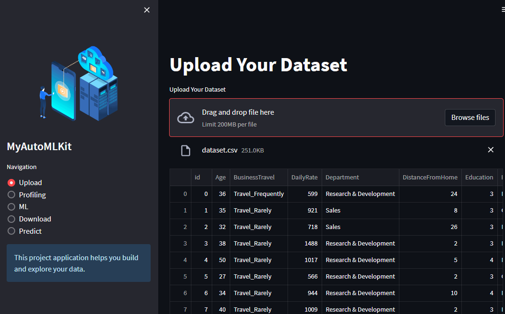
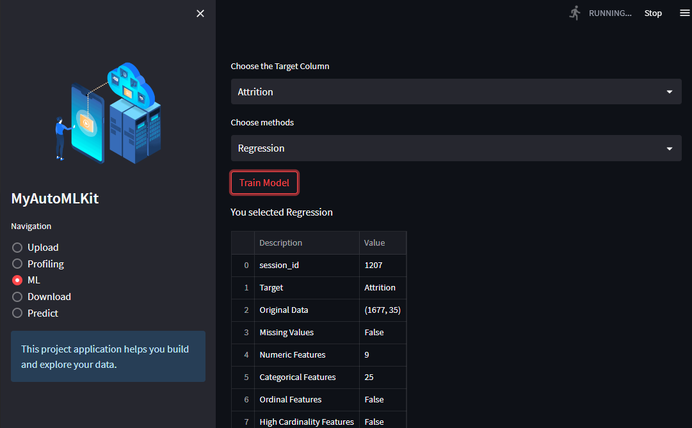
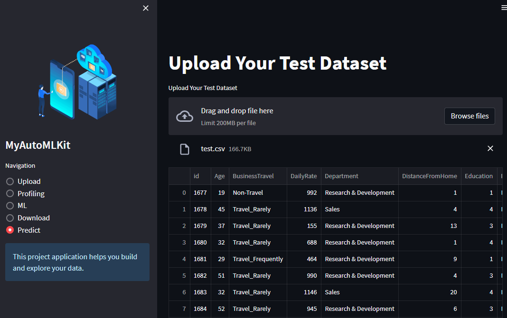

# AutoMLKit App

This app was written in python using `streamlit` and `pycaret` to perform machine learning tasks in an elegant manner.

## Requirements

- python 3.9+

- streamlit

- pycaret 
    - I encountered errors when installing the full version `pip install pycaret[full]`, so we may be missing the two methods: 'xgboost' and 'catboost'."

- check `requirements.txt`

## Quick start

```sh
streamlit run app.py
```

## Example Data

[Kaggle Playground Series Season 3, Episode 3: Tabular Classification with an Employee Attrition Dataset](https://www.kaggle.com/competitions/playground-series-s3e3/overview)

Files:

    - train.csv (remember to rename to dataset.csv)

    - test.csv

Outputs:

    - predict.csv

## Screenshots




